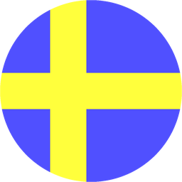

# Python image generation module

## Main module: img_gen

**img_gen** is a small helper module used to create square PNG images programmatically.

The main function in img_gen is **MakeImage**. You provide it with a painting function that takes x, y coordinates in the range [-1, +1], and it automatically creates an anti-aliased image for you in the current working directory. As an example, the code

```python
def pfHello(x, y):
	return (255, 0, 0, 255) if x > y else (0, 255, 0, 255)

img_gen.MakeImage(pfHello, "hello")
```

generates the following image:


## Use case: flag generation

The module **flags** generates different country flags. This was originally designed as a language icon generator for websites, and shows the potential of img_gen. Calling it as a script will generate all the flags:

```
> python flags.py
```

This is a selection of the generated output:





## Use case: icons

The module **shapes** generates an assortment of black and white icons, demonstrating geometrical manipulation and alpha masking. Calling it as a script will generate all the icons:

```
> python shapes.py
```

This is a selection of the generated output:


